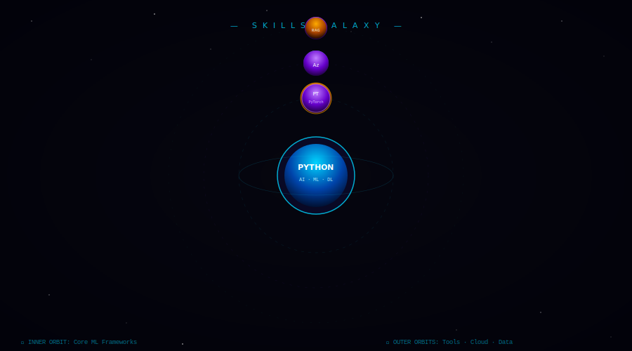
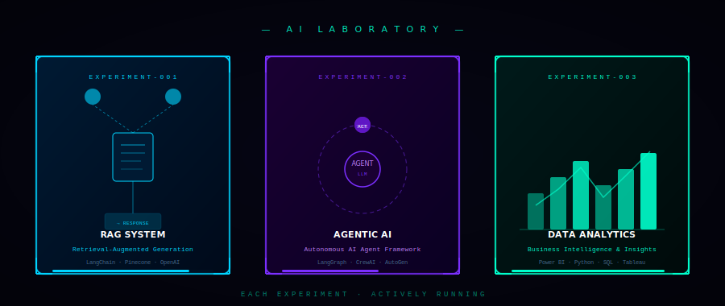

<div align="center">

<!--========================================================
  DHRUV KHANT — GITHUB PROFILE README
  Theme: "The Mind of an AI Engineer"
  
  FOLDER STRUCTURE:
  ├── README.md          ← This file
  └── assets/
      ├── header.svg           ← Cinematic boot sequence + title reveal
      ├── divider.svg          ← Animated energy divider (reused between sections)
      ├── neural-brain.svg     ← Living neural network visualization
      ├── skills-galaxy.svg    ← Skills as orbiting planets
      ├── timeline.svg         ← Animated career timeline beam
      ├── ai-lab.svg           ← Projects as containment chambers
      ├── ml-universe.svg      ← ML concepts as galaxies
      ├── stats-dashboard.svg  ← Futuristic stats panel
      └── ending.svg           ← Portal ending with final message

  EXTERNAL SERVICES USED:
  • GitHub Stats: github-readme-stats.vercel.app
  • Streak Stats:  github-readme-streak-stats.herokuapp.com
  • WakaTime:      github-readme-stats.vercel.app (with WakaTime integration)
  • Trophies:      github-profile-trophy.vercel.app
  
  SETUP: Replace "DhruvKhant" with your actual GitHub username
         in all stats widget URLs below.
=========================================================-->

<!-- ╔══════════════════════════════════════════╗ -->
<!-- ║          SECTION 1 · BOOT SEQUENCE       ║ -->
<!-- ╚══════════════════════════════════════════╝ -->



</div>

<div align="center">

</div>

&nbsp;

<!-- ╔══════════════════════════════════════════╗ -->
<!-- ║       SECTION 2 · NEURAL ARCHITECTURE   ║ -->
<!-- ╚══════════════════════════════════════════╝ -->

<div align="center">



</div>

```
┌─────────────────────────────────────────────────────────────────────────┐
│  IDENTITY MATRIX                                                         │
│  ─────────────────────────────────────────────────────────────────────  │
│  Role       →  Data Analyst · Generative AI Engineer · ML Engineer      │
│  Position   →  Data Analyst Intern @ BrainyBeam Technology              │
│  Focus      →  LLMs · RAG · Agentic AI · MCP · Automation              │
│  Currently  →  Building AI systems that think, reason, and act           │
│  Contact    →  [ LinkedIn ] [ Email ] [ Portfolio ]                      │
└─────────────────────────────────────────────────────────────────────────┘
```

&nbsp;

<div align="center">

</div>

&nbsp;

<!-- ╔══════════════════════════════════════════╗ -->
<!-- ║       SECTION 3 · SKILLS GALAXY         ║ -->
<!-- ╚══════════════════════════════════════════╝ -->

<div align="center">



</div>

&nbsp;

<div align="center">

<!-- Tech stack presented as system modules, not badges -->

```
╔══════════════════╦══════════════════╦══════════════════╦══════════════════╗
║   AI / ML CORE   ║   DATA STACK     ║   CLOUD / INFRA  ║  CREATIVE TECH   ║
╠══════════════════╬══════════════════╬══════════════════╬══════════════════╣
║  Python          ║  PostgreSQL      ║  AWS             ║  Three.js        ║
║  TensorFlow      ║  MySQL           ║  Azure           ║  WebGL           ║
║  PyTorch         ║  Power BI        ║  Docker          ║  OpenCV          ║
║  Scikit-learn    ║  Tableau         ║  MLflow          ║  Streamlit       ║
║  Hugging Face    ║  Pandas          ║  Git / GitHub    ║  Gradio          ║
║  LangChain       ║  NumPy           ║  GCP             ║  FastAPI         ║
║  LlamaIndex      ║  Matplotlib      ║  Linux           ║  Flask           ║
║  CrewAI          ║  Seaborn         ║  Jupyter         ║  React           ║
╚══════════════════╩══════════════════╩══════════════════╩══════════════════╝
```

</div>

&nbsp;

<div align="center">

</div>

&nbsp;

<!-- ╔══════════════════════════════════════════╗ -->
<!-- ║       SECTION 4 · TIMELINE BEAM         ║ -->
<!-- ╚══════════════════════════════════════════╝ -->

<div align="center">



</div>

&nbsp;

<div align="center">

</div>

&nbsp;

<!-- ╔══════════════════════════════════════════╗ -->
<!-- ║       SECTION 5 · AI LABORATORY         ║ -->
<!-- ╚══════════════════════════════════════════╝ -->

<div align="center">



</div>

&nbsp;

<div align="center">

<!-- Project details in system-log format -->

```
┌─── EXPERIMENT LOG ─────────────────────────────────────────────────────────┐
│                                                                             │
│  [EXP-001] RAG SYSTEM                                              ACTIVE  │
│  ├── Stack: LangChain · Pinecone · OpenAI · FAISS                          │
│  ├── Input: Unstructured documents → Semantic vector search                 │
│  └── Output: Context-aware, hallucination-resistant AI responses            │
│                                                                             │
│  [EXP-002] AGENTIC AI FRAMEWORK                                    ACTIVE  │
│  ├── Stack: LangGraph · CrewAI · AutoGen · Ollama                          │
│  ├── Input: Task objectives → Plan → Tool calls → Feedback loop            │
│  └── Output: Autonomous multi-step reasoning & execution                   │
│                                                                             │
│  [EXP-003] BUSINESS INTELLIGENCE PIPELINE                          ACTIVE  │
│  ├── Stack: Power BI · Python · SQL · Pandas · Matplotlib                  │
│  ├── Input: Raw enterprise data → ETL → Modelling → Visualization          │
│  └── Output: Real-time dashboards & strategic decision insights             │
│                                                                             │
└─────────────────────────────────────────────────────────────────────────────┘
```

</div>

&nbsp;

<div align="center">

</div>

&nbsp;

<!-- ╔══════════════════════════════════════════╗ -->
<!-- ║     SECTION 6 · ML UNIVERSE             ║ -->
<!-- ╚══════════════════════════════════════════╝ -->

<div align="center">



</div>

&nbsp;

<div align="center">

```
  KNOWLEDGE DOMAINS · ACTIVE RESEARCH NODES
  ──────────────────────────────────────────────────────────────────────────
  ◉ Generative AI     RAG · Fine-tuning · Prompt Engineering · RLHF
  ◉ Agentic Systems   ReAct · CoT · MCP · Tool Use · Memory · Planning
  ◉ Deep Learning     CNN · RNN · LSTM · Transformers · Attention
  ◉ NLP / LLMs        BERT · GPT · T5 · Llama · Mistral · Gemini
  ◉ Computer Vision   Object Detection · Segmentation · OpenCV · YOLO
  ◉ MLOps             MLflow · DVC · Docker · CI/CD · Model Serving
  ◉ Vector Systems    Embeddings · Pinecone · FAISS · Weaviate · ChromaDB
  ◉ BI & Analytics    ETL · Dashboarding · Statistical Analysis · KPIs
  ──────────────────────────────────────────────────────────────────────────
```

</div>

&nbsp;

<div align="center">

</div>

&nbsp;

<!-- ╔══════════════════════════════════════════╗ -->
<!-- ║     SECTION 7 · GITHUB STATISTICS       ║ -->
<!-- ╚══════════════════════════════════════════╝ -->

<div align="center">



</div>

&nbsp;

<!-- 
  ↓↓↓  REPLACE "DhruvKhant" WITH YOUR ACTUAL GITHUB USERNAME BELOW  ↓↓↓
  The widgets below are live-fetched from the GitHub Stats API services.
  They render as real-time images on your profile page.
-->

<div align="center">

<table>
<tr>
<td>


</td>
<td>


</td>
</tr>
</table>

</div>

&nbsp;

<div align="center">


</div>

&nbsp;

<div align="center">


</div>

&nbsp;

<div align="center">

</div>

&nbsp;

<!-- ╔══════════════════════════════════════════╗ -->
<!-- ║     SECTION 8 · CONTRIBUTION CITY       ║ -->
<!-- ╚══════════════════════════════════════════╝ -->

<div align="center">

```
  ╔═══════════════════════════════════════════════════════════════════════════╗
  ║                    CONTRIBUTION CITY  ·  LIVE SKYLINE                    ║
  ║  Every commit lights a building.  Every push raises a tower.             ║
  ╚═══════════════════════════════════════════════════════════════════════════╝
```

</div>

<!-- 
  Option A (recommended) — Use the "3D Contribution" service:
  Replace "DhruvKhant" with your username in the URL below.
  The image auto-updates weekly.
-->

<div align="center">


</div>

<!--
  Option B — Snake animation (add via GitHub Actions):
  After the snake workflow runs, the .gif will appear at this path.
  See INSTALLATION.md for setup instructions.

  
-->

&nbsp;

<div align="center">

</div>

&nbsp;

<!-- ╔══════════════════════════════════════════╗ -->
<!-- ║     SECTION 9 · HOLOGRAPHIC QUOTE       ║ -->
<!-- ╚══════════════════════════════════════════╝ -->

<div align="center">

```
 ┌────────────────────────────────────────────────────────────────────────┐
 │                                                                        │
 │   ░░  HOLOGRAPHIC TRANSMISSION  ░░░░░░░░░░░░░░░░░░░░░░░░░░░░░░░░░░  │
 │                                                                        │
 │                                                                        │
 │          "Intelligence is not what you know.                           │
 │           It is what you do when you don't know."                      │
 │                                                                        │
 │                                                  — Jean Piaget         │
 │                                                                        │
 │   ░░░░░░░░░░░░░░░░░░░░░░░░░░░░░░░░░░░░░░░░░░░░░░░░░░░░░░░░░░░░░░░   │
 │                                                                        │
 └────────────────────────────────────────────────────────────────────────┘
```

</div>

&nbsp;

<div align="center">

</div>

&nbsp;

<!-- ╔══════════════════════════════════════════╗ -->
<!-- ║     SECTION 10 · PORTAL ENDING          ║ -->
<!-- ╚══════════════════════════════════════════╝ -->

<div align="center">



</div>

&nbsp;

<div align="center">

<!-- Connect links in a clean system-style row -->

```
  ┌───────────────────────────────────────────────────────┐
  │  CONNECT · COLLABORATE · BUILD                        │
  │  ─────────────────────────────────────────────────── │
  │  LinkedIn  →  linkedin.com/in/dhruv-khant             │
  │  Email     →  [ your email here ]                     │
  │  Portfolio →  [ your portfolio link ]                 │
  │  GitHub    →  github.com/DhruvKhant                   │
  └───────────────────────────────────────────────────────┘
```

</div>

&nbsp;

<div align="center">


</div>

&nbsp;

<div align="center">

</div>

<!--
━━━━━━━━━━━━━━━━━━━━━━━━━━━━━━━━━━━━━━━━━━━━━━━━━━━━━━━━━━━━
  See INSTALLATION.md for setup instructions, GitHub Actions
  snake workflow, and how to keep stats widgets live.
━━━━━━━━━━━━━━━━━━━━━━━━━━━━━━━━━━━━━━━━━━━━━━━━━━━━━━━━━━━━
-->
